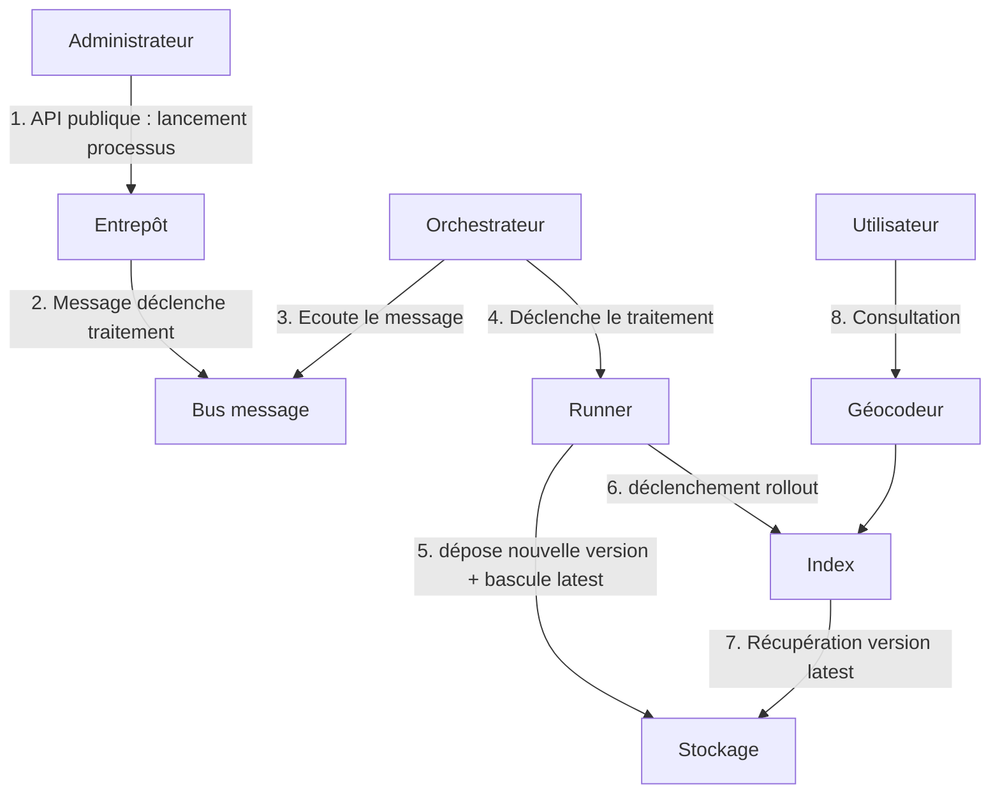

# Lancer une réindexation sur la géoplateforme

## Pré requis

Il faut avoir un datastore configuré dans l'entrepôt.

## Principe



## Procédure

En utilisant les apis entrepôts de l'environnement souhaité :

* Faire un appel `/datastores/{{DATASTORE_ID}}/processings` pour récupérer l'identifiant du processus

```json
 {
        "name": "Géocodeur Poi",
        "description": "Géocodeur Poi",
        "_id": "XXXX"
    },
    {
        "name": "Géocodeur Parcel",
        "description": "Géocodeur Parcel",
        "_id": "YYYY"
    },
    {
        "name": "Géocodeur Adresse",
        "description": "Géocodeur Adresse",
        "_id": "ZZZZ"
    },
```

* Créer une exécution de traitement par l'appel `/datastores/{{DATASTORE_ID}}/processings/executions`

```json
{
    "processing": "{{PROCESSING_ID}}",
    "inputs": {},
    "output": {},
    "parameters": {
        "{{PARAMETER_NAME}}": "{{PARAMETER_VALUE}}"
    }
}
```

* Déclencher le traitement par l'appel `/datastores/{{DATASTORE_ID}}/processings/executions/{{PROCESSING_EXECUTION_ID}}/launch`

## Paramètrages

Chaque traitement est paramétrable. Pour obtenir la liste des paramètres liés à chaque traitement :

* Faire un appel `/datastores/{{DATASTORE_ID}}/processings/{{PROCESSING_ID}}` pour récupérer la liste des `parameters`

```json
{
    "name": "Géocodeur Adresse",
    "description": "Géocodeur Adresse",
    "priority": "PREMIUM",
    "input_types": {
        "upload": [],
        "stored_data": []
    },
    "parameters": [
        {
            "name": "ban_addok_url",
            "description": "Structure d'URL du millésime BAN Addok",
            "mandatory": true,
            "constraints": {
                "type": "string"
            }
        }
    ],
    "_id": "{{PROCESSING_ID}}",
    "required_checks": []
}
```

### POI

Variable | Description | Valeur
---------|----------|---------
 ADMIN_EXPRESS_URL |  Structure d'URL du millésime ADMIN COG à utiliser | <https://gpf-ign-data.s3.sbg.io.cloud.ovh.net/admin-express/ADMIN-EXPRESS-COG_3-2__SHP_WGS84G_FRA_2023-05-03.7z>
 BDTOPO_URL | Structure d'URL du millésime BD TOPO à utiliser | <https://gpf-ign-data.s3.sbg.io.cloud.ovh.net/bdtopo/BDTOPO_3-3_TOUSTHEMES_GPKG_{crs}_{dep}_2023-09-15.7z>

### Adresses

Variable | Description | Valeur
---------|----------|---------
 BAN_ADDOK_URL | Structure d'URL du millésime BAN Addok à utiliser | <https://adresse.data.gouv.fr/data/ban/adresses/latest/addok/adresses-addok-{dep}.ndjson.gz>

### Parcelles

Variable | Description | Valeur
---------|----------|---------
 PARCELLAIRE_EXPRESS_URL |  Structure d'URL du millésime PARCELLAIRE EXPRESS à utiliser | <https://gpf-ign-data.s3.sbg.io.cloud.ovh.net/parcellaire-express/PARCELLAIRE_EXPRESS_1-1__SHP_{crs}_{dep}_2023-07-01.7z>

## Suivi

Les logs du traitement une fois lancé sont disponibles via l'appel `/datastores/{{DATASTORE_ID}}/processings/{{PROCESSING_ID}}/logs`
